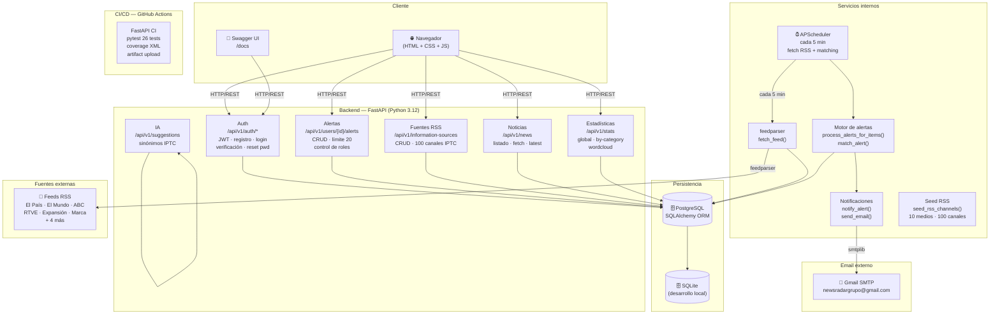
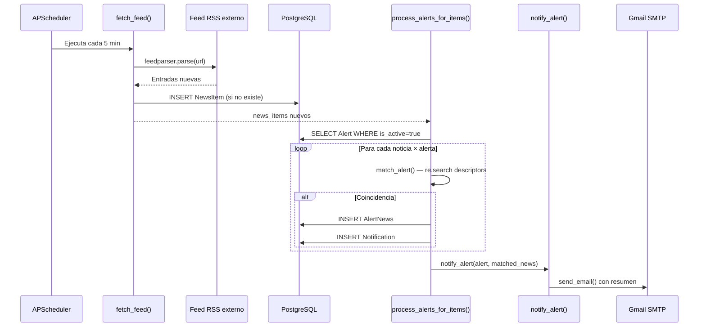
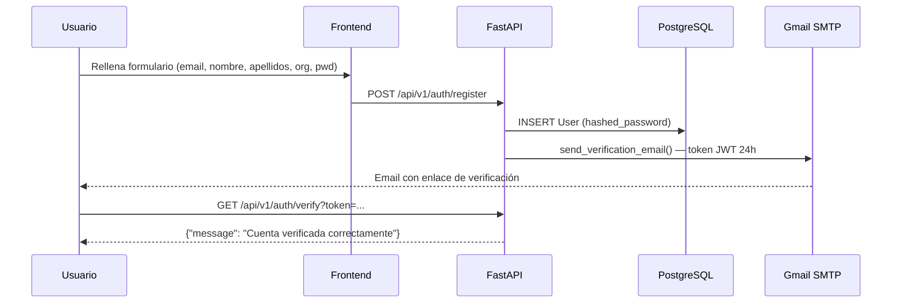
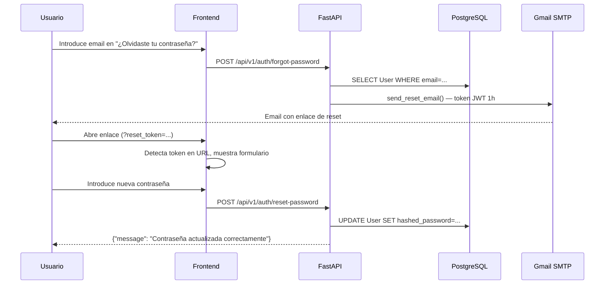

# Arquitectura del sistema NewsRadar

## Diagrama de componentes

---

## Diagrama de flujo — Motor de alertas (Sprint 5)

---

## Diagrama de flujo — Registro y verificación de usuario

---

## Diagrama de flujo — Recuperación de contraseña

---

## Stack tecnológico

| Capa | Tecnología |
|---|---|
| Backend | FastAPI + Python 3.12 |
| ORM | SQLAlchemy |
| Base de datos (prod) | PostgreSQL 15 |
| Base de datos (dev) | SQLite |
| Autenticación | JWT (python-jose + passlib) |
| RSS | feedparser |
| Scheduler | APScheduler |
| Email | smtplib + Gmail SMTP |
| Contenedores | Docker + Docker Compose |
| Frontend | HTML + CSS + JavaScript (vanilla) |
| CI/CD | GitHub Actions |
| Tests | pytest + pytest-cov (26 tests) |
